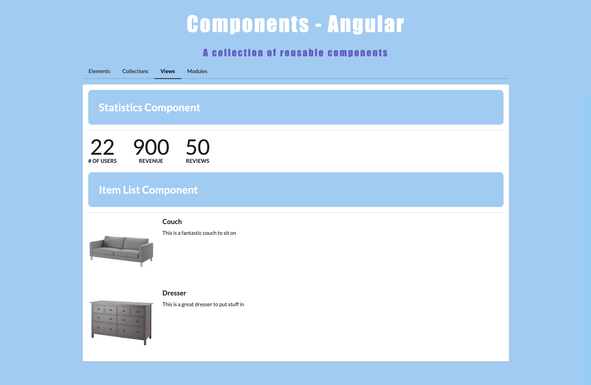

# Components - Angular 

  ## Description

  This is an app built using Angular which is a collection of reusable customizable components such as Segment, Placeholder, Table, Tabs, Statistics, Item List, Modal, & Accordion components.  For styling, Semantic UI was mainly used for the various components.  Angular routing was used for navigation.

  App screenshots:

  
  
  
  ## Table of Contents
  
  - [Installation](#installation)
  - [Usage](#usage)
  - [License](#license)
  - [Contributing](#contributing)
  - [Tests](#tests)
  - [Questions](#questions)
  
  ## Installation
  
  Deployed URL:  https://billstephens2022.github.io/Components-Angular/
  
  ## Usage
  
  Use the navigation bar to view the various components.

  ## License
This application is covered under the MIT License.
 For more information: https://opensource.org/licenses/MIT
  
  ## Contributing
  N/A
  
  ## Tests
  N/A

  ## Questions
  Contact Info 
  GitHub user name: BillStephens2022 
  Link to GitHub profile: https://github.com/BillStephens2022 
  Email: stephensbill17@gmail.com